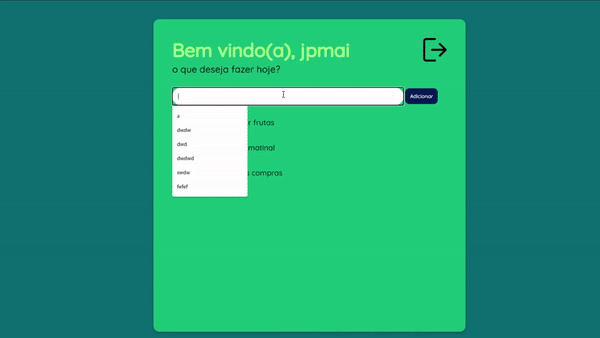

# ToDoList - Lista de Taredas com Django 3.0 📄👨🏽‍💻

A aplicação permite a realização de login e logout, de modo que cada usuário cadastrado tenha acesso à sua própria lista.

## Info 

- Python 3.9 🐍
- Django 3.0 💻
- Vídeo de referência [(link)](https://www.youtube.com/watch?v=4RWFvXDUmjo) 
- Paleta de cores utilizada: 

